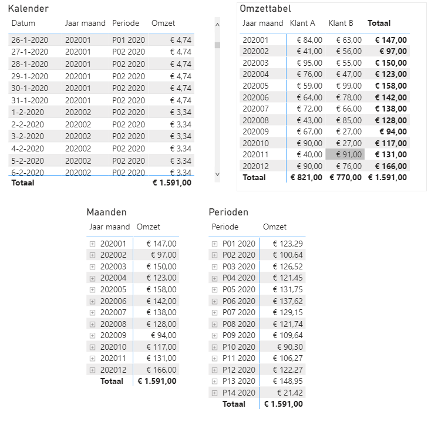

## Month to 4-week period conversion (DAX)

Convert monthly sales or budgets to 4-week periods. The screenprint below shows the calendar table (top left) and a 
source table with monthly sales (top right). The DAX formula calculates the revenue ('Omzet') for each day of the year 
by dividing the monthly sales by the number of days in the month. The result is summed so that each month and period 
show the correct amount.

    Omzet = 
    VAR OmzetPerDag =
        ADDCOLUMNS (
            Kalender,
            "AantalDagen",
                DATEDIFF (
                    STARTOFMONTH ( Kalender[Date] ),
                    ENDOFMONTH ( Kalender[Date] ) + 1,
                    DAY
                ),
            "OmzetMnd",
                CALCULATE (
                    SUM ( Omzet[Bedrag] ),
                    FILTER (
                        VALUES ( Omzet[Jaar maand] ),
                        Omzet[Jaar maand] = Kalender[Jaar maand]
                    )
                )
        )
    VAR Result = 
        SUMX ( 
            OmzetPerDag, 
            DIVIDE ( [OmzetMnd], [AantalDagen] )
        )
    RETURN
        Result